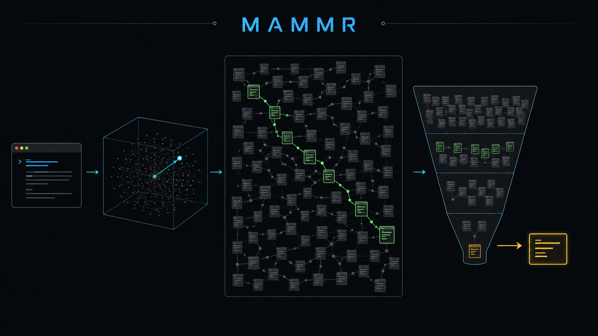

# MAMMR



MAMMR is a benchmark for multilingual agent memory retrieval.

Agent memory retrieval is not generic semantic search. A long-running agent often receives a short, vague query like "what was the VPS issue?" and must recover a long, messy memory involving commands, logs, configuration, stale state, and Turkish-English code-switching.

This repository is the public v0.1 candidate. It includes a sanitized dataset candidate, a runnable OpenAI-compatible embedding evaluator, pinned local-GGUF results, held-out and full-corpus retrieval evidence, a sanitized reranker matrix, OpenClaw/NoldoMem guidance, and a technical report.

It is not a general search benchmark. It focuses on the kind of recall problem long-running coding and operations agents face:

- short vague queries
- long conversational memories
- Turkish and English code-switching
- stale versus current operational state
- command, log, and config references
- false positives that waste context or cause wrong recalls

MAMMR was motivated by a real OpenClaw + NoldoMem memory stack running on a CPU-only VPS. That context matters. The production recommendation favors models that were accurate enough while staying small, fast, and stable under VPS resource limits.

If you run an agent on a Mac Studio, Mac mini, workstation GPU, or dedicated inference server, do not copy the production recommendation blindly. Use this dataset and runner to test your own backend. Stronger hardware may make larger local embedding models or local rerankers more practical.

## What To Read First

| If you want to... | Start here |
|-------------------|------------|
| understand the main findings | `docs/results-at-a-glance.md` |
| verify the frozen release evidence | `RELEASE-MANIFEST.md` |
| review the artifact critically | `docs/reviewer-guide.md` |
| understand domain breadth and limits | `docs/domain-coverage.md` |
| run your own model | `docs/running-your-model.md` |
| use this with OpenClaw/NoldoMem | `docs/openclaw-noldomem-guide.md` |
| validate the public artifact in 0G Sandbox | `docs/0g-sandbox-reproducibility.md` |
| understand what is publishable today | `docs/publication-scorecard.md` |
| see what blocks a real public leaderboard | `docs/validation-roadmap.md` |
| read the technical report | `paper/manuscript.md` |

## Current Status

This is a public v0.1 candidate, not the final release.

What is ready:

- sanitized 305-pair public dataset candidate
- privacy scan report
- OpenAI-compatible embedding runner
- technical report under `paper/`
- Qwen3 diagnostic reruns on the sanitized set
- structural dataset audit and P0 semantic review
- P1/P2 cleanup review using cross-model failure overlap
- pinned P0 local-GGUF reruns for Qwen3, Snowflake, BGE-M3, and Jina-v3
- held-out mini-set evidence
- full-corpus plus synthetic-distractor retrieval evidence
- sanitized public reranker matrix for Cohere Rerank 4 Pro and Cohere Rerank v3.5
- second-model label review sample and agreement report
- aggregate-only domain coverage report
- one-command public release preflight
- 0G Sandbox clean-room preflight run record for the current public candidate package
- frozen release manifest
- reviewer guide
- model-assisted public privacy and scope review

What still needs before broader leaderboard claims:

- add human independent label review
- add larger external-domain or production-like distractor corpora
- add more non-DevOps domains
- maintainer review before a stronger v0.2 claim

Before any public announcement, the owner should still do a final publication approval pass. That pass is a release workflow guard, not a benchmark evidence claim.

## Files

| Path | Purpose |
|------|---------|
| `data/mammr_pairs_public.json` | Sanitized public pair set candidate. |
| `data/privacy_report.json` | Automated path, token, identifier, and denylist scan report. |
| `scripts/run_embedding_eval.py` | Runs the public pairwise and same-category retrieval evaluation against an OpenAI-compatible embedding endpoint. |
| `scripts/run_retrieval_eval.py` | Runs full-corpus retrieval with optional synthetic distractors. |
| `scripts/run_reranker_eval.py` | Runs hosted reranker evaluation over embedded candidates. |
| `scripts/audit_dataset.py` | Checks public dataset structure, labels, safety, and retrieval-pool hygiene. |
| `scripts/audit_domain_coverage.py` | Summarizes category and domain coverage without printing pair text. |
| `scripts/public_release_preflight.py` | Runs the public safety, audit, hash-chain, stale-reference, JSON, and whitespace checks. |
| `scripts/triage_cleanup_candidates.py` | Recomputes the cleanup priority queue without printing pair text. |
| `docs/running-your-model.md` | Developer instructions for testing a model. |
| `docs/reproducing-pinned-local-gguf.md` | Exact reproduction guide for the pinned public local-GGUF reruns. |
| `docs/openclaw-noldomem-guide.md` | Practical guide for OpenClaw/NoldoMem memory users. |
| `docs/0g-sandbox-reproducibility.md` | Clean-room validation flow for running the public artifact in 0G Sandbox. |
| `docs/public-scope-and-privacy-review.md` | Public naming, privacy, and release-scope review record. |
| `RELEASE-MANIFEST.md` | Frozen evidence boundary, hashes, headline metrics, and validation record. |
| `docs/reviewer-guide.md` | Critical review path, claim boundaries, and reproduction checklist. |
| `docs/results-at-a-glance.md` | Short results summary and takeaways. |
| `docs/domain-coverage.md` | Aggregate domain coverage report and breadth caveats. |
| `docs/publication-scorecard.md` | Public readiness scorecard and claim levels. |
| `docs/validation-roadmap.md` | Held-out, rerun, annotation, and full-corpus validation plan. |
| `docs/heldout-and-independent-review-protocol.md` | Exact next protocol for held-out and second-review validation. |
| `docs/dataset-quality-report.md` | Current structural audit report for the public pair set. |
| `docs/p0-cleanup-review.md` | Manual semantic review of the worst public Qwen3 high-pair failures. |
| `docs/p1-p2-cleanup-review.md` | Broader cleanup review showing why the dataset should not be tuned to Qwen3. |
| `docs/pinned-failure-overlap-review.md` | Cross-model failure overlap analysis for the pinned public reruns. |
| `docs/pinned-public-reruns.md` | Pinned four-model public local-GGUF rerun results. |
| `docs/full-corpus-distractor-results.md` | Full public corpus plus synthetic-distractor retrieval results. |
| `docs/heldout-mini-results.md` | Held-out mini-set retrieval results. |
| `docs/sanitized-reranker-matrix.md` | Sanitized public reranker matrix for Cohere 4 Pro and v3.5. |
| `docs/independent-label-review-codex-20260506.md` | Second-model label review and disagreement summary. |
| `docs/label-disagreement-review-queue.md` | Compact human-review queue for the 20 label disagreements. |
| `docs/rerun-matrix.md` | Required reruns before public leaderboard claims. |
| `docs/backend-divergence.md` | Why current public diagnostic results are not a leaderboard. |
| `docs/backend-pinning-plan.md` | Required backend metadata for reproducible public reruns. |
| `docs/cleanup-candidate-triage.md` | Priority breakdown for high-pair cleanup candidates. |
| `paper/manuscript.md` | Technical report draft. |
| `NEXT-STEPS.md` | Recommended path from candidate bundle to real public leaderboard. |

## Quick Start

Prerequisites:

- Python 3.10 or newer
- no Python package install for the core scripts
- an OpenAI-compatible `/v1/embeddings` endpoint for real model runs

The pinned local-GGUF results were produced by serving GGUF files through `llama-server`, which exposes an OpenAI-compatible embeddings API shape. The same public runner can also test any other backend that implements `/v1/embeddings`.

Dry-run the dataset:

```bash
python3 scripts/run_embedding_eval.py --dry-run
```

Public-user entry points are `scripts/run_embedding_eval.py`, `scripts/run_retrieval_eval.py`, `scripts/run_reranker_eval.py`, and `scripts/public_release_preflight.py`. Other scripts are maintainer release tools unless a doc page names them directly.

Run the full public preflight before sharing or comparing results:

```bash
python3 scripts/public_release_preflight.py
```

Evaluate a local embedding server:

```bash
python3 scripts/run_embedding_eval.py \
  --endpoint http://localhost:8090/v1/embeddings \
  --endpoint-label local-llama-server \
  --model my-embedding-model \
  --output results/my-model.json
```

Evaluate an API model:

```bash
export OPENAI_API_KEY="YOUR_API_KEY"

python3 scripts/run_embedding_eval.py \
  --endpoint https://api.example.com/v1/embeddings \
  --endpoint-label provider-api \
  --model provider/model-name \
  --api-key-env OPENAI_API_KEY \
  --output results/provider-model-name.json
```

## Interpreting Results

The runner reports:

- `weighted_score`: category-weighted threshold accuracy
- `unweighted_score`: raw pair pass rate
- `mrr`: ranking quality for high-relevance pairs inside same-category pools
- `recall_at_5`: whether the target is in the top five same-category candidates

Use these together. A model can rank well but be poorly calibrated, or pass thresholds while ranking less precisely.

The label bands intentionally overlap. They are tolerance zones for expected similarity, not disjoint classes. For example, a borderline pair can be acceptable as either `medium` or `medium_high` depending on the annotated relationship.

The included Qwen3 diagnostic runs are intentionally kept to show the public-release gate catching a mismatch between sanitized data, thresholds, and the public rerun backend. The pinned four-model public rerun set is the result set to use for public v0.1 local-GGUF comparisons.

## Release Principle

The benchmark was motivated by real operational memory. This public v0.1 candidate is sanitized so developers can inspect and run the benchmark without exposing private infrastructure. Automated scanners and model-assisted public-scope reviews are included, but they are not a substitute for final owner approval before public announcement.

Do not publish raw vector caches, raw VPS result folders, DB exports, or unsanitized pair text.

## License

Code is released under the MIT License. Dataset, docs, and paper text are intended for CC BY 4.0. See `LICENSE` and `LICENSE-DATA-DOCS.md`.
